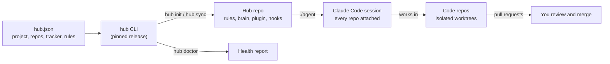
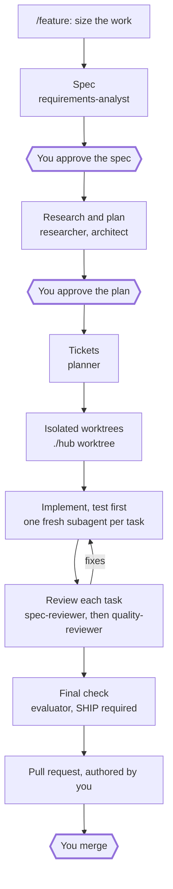
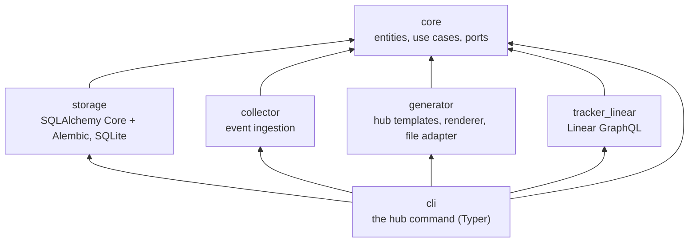

<!-- TODO: add a logo at docs/assets/logo.svg (and logo-dark.svg for a <picture> light/dark pair) -->

<h1 align="center">agent-hub</h1>

<p align="center">
  <strong>A home base for AI coding agents, for developers who run Claude Code across several repos.<br>
  One command gives each project shared rules, memory and workflow, pinned to a version and kept up to date.</strong>
</p>

<p align="center">
  <a href="https://github.com/jroquette/agent-hub/actions/workflows/ci.yml"></a>
  
  <!-- Static badge: bump with each release tag (scripts/check_release.py keeps the package versions in lockstep; follow-up: automate). -->
  
  
</p>

<p align="center">
  <a href="docs/SPEC.md">Spec</a> ·
  <a href="#-quick-start">Quick Start</a> ·
  <a href="#-usage-guide">Usage guide</a> ·
  <a href="#-roadmap">Roadmap</a> ·
  <a href="#-contributing">Contributing</a>
</p>

<!-- TODO: record a demo GIF (hub init → ./agent) and put it here -->

```bash
hub init demo --repos acme/backend,acme/frontend --tracker linear:DEMO \
  --branch-prefix jdoe/ --hub-repo acme/demo-hub
```

```text
created 60 files (40 managed, 20 seeded) and 14 links in /home/jdoe/work/demo-hub

Next steps:
  1. cd /home/jdoe/work/demo-hub
  2. review hub.json, AGENTS.project.md and README.md
  3. git add -A && git commit -m "Create the hub"
  4. start Claude Code with every repo attached: ./agent
  5. to upgrade later: edit platform.version in hub.json, then run hub sync
```

> [!IMPORTANT]
> agent-hub is **experimental** (0.x, Phase 1 of 4 in the [spec](docs/SPEC.md)). The hub generator and its commands
> work and are tested; the web control plane does not exist yet. The repository is private, and every install needs
> read access to it.

## Contents

- [What is this?](#-what-is-this)
- [Why use it?](#-why-use-it)
- [How it works](#-how-it-works)
- [Quick Start](#-quick-start)
- [Daily workflow](#-daily-workflow)
- [Usage guide](#-usage-guide)
- [Configuration](#-configuration)
- [Technical reference](#-technical-reference)
- [Roadmap](#-roadmap)
- [FAQ](#-faq)
- [Contributing](#-contributing)
- [License and credits](#-license-and-credits)

## 💡 What is this?

AI coding agents such as Claude Code can now write, test and open pull requests on their own. To do that well, they
need the same things a new teammate needs: the project's rules, its memory of past decisions, and a clear way of
working. Today that setup is written by hand, one project at a time, and it drifts as soon as a second project copies
it.

agent-hub turns that setup into a product. For each project it creates a **hub**: a small private git repository that
sits next to the project's code repositories (the *repos*) and holds everything the agents should know and follow.
Think of it as the project's operations room: the code lives in the repos, while the hub keeps the rulebook, the
notebook and the checklists that every agent session starts from.

The hub is generated by the `hub` command-line tool (CLI, a program you run in the terminal). The same tool later
updates the hub to a newer template without overwriting what your project changed, checks that the hub is healthy,
and starts agent sessions with every repo attached.

The longer-term goal, described in the [spec](docs/SPEC.md), is to also *observe* the agents: see on one screen what
each session did, decided and learned.

## ✨ Why use it?

- 🚀 **Start a new project in minutes, not days.** `hub init` writes the rules, the memory folder, the workflow plugin,
  the safety hooks and the launcher in one go.
- 🔁 **Upgrade without losing your changes.** `hub sync` updates the files the platform owns and leaves the ones your
  project owns alone; a lock file tells them apart.
- 📌 **Same behavior on every machine.** Each hub pins one release of the tool, so your laptop, CI and cloud sessions
  run exactly the same version, with no global install.
- 🛡️ **Guardrails built in.** The generated hooks block secrets, pushes to `main`, force-pushes and AI attribution, and
  keep a session from finishing while the repo's fast checks fail on the code it changed.
- 🩺 **Catch problems early.** `hub doctor` finds broken links, missing files, oversized instruction files and drift
  from the template, each with a one-line fix.
- 🧠 **Memory you control.** Agents propose what they learned into an inbox; only a human promotes it into the brain.

| Without agent-hub | With agent-hub |
| --- | --- |
| Rules, launcher and hooks copied by hand from another project | Generated from `hub.json` in one command |
| Project names hard-coded in scripts | Every project value lives in one validated file |
| Template fixes copied project by project | `hub sync` brings them in and keeps your edits |
| Each machine runs whatever version it has | The release is pinned per hub and fetched on demand |

## 🧭 How it works



You describe the project once in `hub.json`: its name, its repos, its task tracker and a few rules. The `hub` CLI turns
that file into a hub repository full of ready-to-use files. When you run `./agent` from the hub, Claude Code starts
with every repo attached and the hub's rules, memory and workflow already loaded. The agent works in isolated copies of
the repos (git worktrees), and every change reaches `main` only through a pull request that you merge.

## 🚀 Quick Start

**Prerequisites**

- [uv](https://docs.astral.sh/uv/getting-started/installation/) **0.9.0 or newer** (it installs Python 3.14 for you).
- `git` and `python3` on your `PATH` (the shims and hooks use the system `python3`, 3.9 or newer).
- **Read access to this private repository**: your GitHub credentials through a git credential helper (for example
  `gh auth setup-git`), or this repository attached to a cloud session. Never put a token inside the `git+https://` URL.
- [Claude Code](https://docs.anthropic.com/en/docs/claude-code) (the `claude` command) to run `./agent`.
- Optional: [`gh`](https://cli.github.com/) for the PR and CI lines of `hub brief`, and a Linear workspace for the
  tracker.

**1. Check that you can run the CLI.** `uvx` builds the tagged release from git and caches it; the first run takes a
little longer.

```bash
uvx --from 'git+https://github.com/jroquette/agent-hub@v0.4.0#subdirectory=packages/agent-hub' hub --version
```

You should see `0.4.0`.

> [!TIP]
> To have `hub` on your `PATH`, install it once with
> `uv tool install 'git+https://github.com/jroquette/agent-hub@v0.4.0#subdirectory=packages/agent-hub'`.
> Generated hubs never need this: their `./hub` shim runs the release pinned in `hub.json`.

**2. Create an empty folder for the hub.** It should be a sibling of the project's repos.

```bash
mkdir -p demo-hub && cd demo-hub && git init
```

**3. Generate the hub.** Replace the project name, repos, tracker team, branch prefix and hub repo with yours
(`--hub-repo` is needed until the folder has a GitHub `origin`). The author comes
from your git `user.name` and `user.email` unless you pass `--author-name` and `--author-email`.

```bash
uvx --from 'git+https://github.com/jroquette/agent-hub@v0.4.0#subdirectory=packages/agent-hub' \
  hub init demo --repos acme/backend,acme/frontend --tracker linear:DEMO --branch-prefix jdoe/ --hub-repo acme/demo-hub
```

You should see `created 60 files (40 managed, 20 seeded) and 14 links` followed by the next steps.

> [!NOTE]
> `hub init` writes only into an empty folder (a `.git` is fine). Run it again in the same folder and it refuses with
> `already a hub; run hub sync`, writing nothing. In a folder holding other files it refuses and suggests
> `hub sync --adopt`, which joins a hand-made hub from 0.7.0 on; with an older release, use a new empty folder instead.

**4. Check the new hub.** From now on, use the hub's own `./hub` shim.

```bash
./hub doctor
```

Expected output (the infos only say that the repos are not cloned next to the hub yet):

```text
info brain.leak ../backend: repo backend is not checked out next to the hub; its repo checks are skipped Fix: clone the repo next to the hub
info brain.leak ../frontend: repo frontend is not checked out next to the hub; its repo checks are skipped Fix: clone the repo next to the hub
0 errors, 0 warnings, 2 infos
```

**5. Check that the hub matches its release.** `--check` only plans and writes nothing.

```bash
./hub sync --check
```

You should see `up to date`.

**6. Commit it and start an agent session.**

```bash
git add -A && git commit -m "Create the hub"
./agent
```

> [!NOTE]
> `./agent` (and `hub agent`) attaches the repos listed in `hub.json` that are cloned next to the hub (`../backend`,
> `../frontend` in this example), prints a `not attached` warning for each one it cannot find, and passes every
> other argument to `claude`.

## 🔄 Daily workflow

Once the hub exists, you work inside Claude Code. The hub gives it a set of slash commands (*skills*) and helper agents
(*subagents*), shipped in the generated `plugin/hub-workflow/` plugin. You type the commands, for example `/kickoff`, in
a session started with `./agent` from the hub. The commands hand parts of the work to the agents.

You stay in charge of the decisions: you approve the spec and the plan, and you merge the pull request. The agents do
the rest, and the hooks keep them inside the project's rules.

### Your session routine

1. **Start with `/kickoff`** (or after `/clear`). It shows the session brief (`./hub brief`), reads `brain/now.md` and
   the newest journal day, runs `check_fast` in each repo that has local changes, and proposes the next item. It asks
   before starting and never edits anything.
2. **Do the work.** Use `/feature` for a change, `/research` or `/recall` for questions (see
   [Skills and agents](#skills-and-agents)).
3. **End with `/handoff`.** It rewrites `brain/now.md` (focus, work in flight, the exact next step, risks to watch)
   and appends what was done, verified and learned to the day's journal, `brain/journal/YYYY/MM/DD.md`. The next
   session picks up from there without you explaining it again.

### From idea to merged change: `/feature`

`/feature <idea or issue id>` is the golden path. It sizes the work first, then chains the agents below. The hexagons
are where it stops and waits for you.



The size decides the ceremony:

- **Spike**: throwaway learning. No spec, no tickets and no plan gate; it is timeboxed, the findings go to
  `research.md`, and nothing is merged.
- **Bounded**: a few pull requests at most, with a known design. You may approve the spec and the plan together.
- **Architectural**: new contracts, paths under `guard.ask_before_edit`, or a design across repos. Both gates apply.

<details>
<summary><strong>What happens at each step</strong></summary>

1. **Size it.** The session asks if the size is unclear.
2. **Spec.** The `brainstorming` skill asks you questions one at a time in the main session, then
   `requirements-analyst` writes `brain/features/<slug>/spec.md` with acceptance criteria (Given/When/Then).
3. **Research and plan.** `researcher` writes `research.md` (or `/research` runs inline for small questions);
   `architect` writes `plan.md`, small tasks each with a verification command.
4. **Tickets.** `planner` writes `features.json` (checked by `./hub doctor --only features.tracker`) and `issues.md`;
   the session then creates the issues in the tracker team from `hub.json`.
5. **Workspace.** `./hub worktree <team>-<n>-<slug>` creates the worktrees, named after the issue.
6. **Implement.** One fresh subagent per task, failing test first, the repo's `check_fast` green after each task.
   Existing assertions are never weakened.
7. **Review.** `spec-reviewer` checks the diff matches the spec and plan, nothing missing and nothing extra; then
   `quality-reviewer` checks domain rules, security and idempotency. Fixes go back to the implementer.
8. **Verify and finish.** `evaluator` re-runs every check and writes `eval.md`; it must say `SHIP`. The pull request is
   opened on a `project.branch_prefix` branch, authored by you.
9. **Compound.** You go through the agents' learning proposals in `brain/_inbox/` and decide where each lands;
   `/handoff` if the work spans sessions.

</details>

> [!IMPORTANT]
> `/feature` expects two things the hub does not install:
>
> - the [superpowers](https://github.com/obra/superpowers) plugin, for its `brainstorming`,
>   `subagent-driven-development`, `test-driven-development` and `finishing-a-development-branch` skills;
> - a tracker connector in Claude Code (for example Linear), so the session can create the issues. The `hub` CLI has
>   no tracker command in 0.4.0.
>
> Set both up in Claude Code yourself before your first `/feature`.

### Skills and agents

| Command | What it does | When to use it |
| --- | --- | --- |
| `/kickoff` | Shows the brief, runs the fast checks in repos with changes, proposes the next item | At the start of a session, or after `/clear` |
| `/feature <idea or issue>` | Takes an idea to a merged, verified change (above) | For any change to the repos |
| `/handoff [title]` | Updates `brain/now.md` and the day's journal | At the end of a session |
| `/research <question or issue>` | Documents how the code works today, with `path:line` references and no critique; writes `research.md` | Before planning, or for a question that spans many files |
| `/create-plan <issue or slug>` | Turns a spec and its research into `plan.md`: small tasks, contracts first, each with a verification command; waits for your approval before any code | When a spec is ready and needs a plan |
| `/recall <topic>` | Answers "what do we know about X, why was Y decided" from the brain, ADRs and past session transcripts, with sources | Before deciding something again |
| `/learn <one sentence>` | Proposes one verified, non-obvious learning to `brain/_inbox/`; you decide whether and where it lands | When the next session should know something |

Claude runs `/kickoff`, `/feature`, `/handoff` and `/learn` only when you type them; it may use the other three on its
own when they fit.

<details>
<summary><strong>The agents behind the commands</strong></summary>

`/feature` starts these agents, each in a fresh context. Each one reads the brain first and ends with a compound step:
at most one learning proposal for `brain/_inbox/` (the `spec-reviewer` reports plan ambiguities instead).

| Agent | Role | Writes | Read-only? |
| --- | --- | --- | --- |
| `requirements-analyst` | Drafts the spec: acceptance criteria in Given/When/Then, non-functional requirements, invariants, open questions | `spec.md` | Writes only the spec |
| `researcher` | Documents how the code works today across the repos, with `path:line` evidence | `research.md` | Yes, apart from `research.md` |
| `architect` | Turns the approved spec and research into a plan, with ADR drafts for architectural decisions | `plan.md`, `adr-draft-<topic>.md` | No code or tests |
| `planner` | Turns the approved plan into one entry per acceptance criterion and tracker issue drafts; does not call the tracker | `features.json`, `issues.md` | Writes only those two files |
| `spec-reviewer` | After each task: does the diff match the spec and plan, nothing missing and nothing extra | PASS or FAIL | Yes (no write tool) |
| `quality-reviewer` | After `spec-reviewer` passes: domain invariants, security and secrets, idempotency | APPROVE or CHANGES | Yes (no write tool) |
| `evaluator` | Final verdict: re-runs every verification, `check_fast`, `check` and `hub doctor` | `eval.md` (SHIP or NO-SHIP), `features.json` | Writes only those two files |

</details>

**Add your own.** Put a skill in `plugin/<project>/skills/<name>/SKILL.md` or an agent in
`plugin/<project>/agents/<name>.md`, then run `./hub sync`: it links them into `.claude/`, where every session in the
hub finds them. Pick a name `hub-workflow` does not use: on a clash `hub sync` stops with a conflict (exit 3) and writes
nothing until you rename yours.

### What the hooks do for you

Hooks are small scripts Claude Code runs on its own at fixed moments; you never call them. The hub has six:

- **When a session starts** (`SessionStart`), the brief from `./hub brief` is put in the agent's context. If the pinned
  release cannot run, a shorter brief with `brain/now.md` and the names of the newest journal files takes its place,
  and its header says why.
- **Before the agent runs a command or opens or changes a file** (`PreToolUse`), the *guard* blocks dangerous actions
  (force-pushes, pushes to the default branch, reading secret files, AI attribution) and asks you before risky ones
  (removing test assertions, editing the hooks or `hub.json`, paths in `guard.ask_before_edit`).
- **After each edit** (`PostToolUse`) of a file in a repo, the repo's own formatter and linter run on it (they tidy the
  code and point out mistakes: ruff for Python, prettier and eslint for JavaScript and TypeScript, when the repo has
  them installed), and any problem left over goes back to the agent.
- **When the agent wants to finish** (`Stop`), the *stop gate* runs `check_fast` in each repo whose code changed during
  the session. While a check fails, it blocks the finish and sends the failures back to the agent. After 3 blocks in a
  row it lets go with a warning, so a session never loops forever. When the checks pass, it reminds the agent to run
  `/handoff`.
- **Before Claude Code shortens a long conversation to free memory** (`PreCompact`), a snapshot (your last request, and
  the branch and changed files of each checkout) is saved to `brain/auto/workspace/session-snapshot.md` and put back
  in the context afterwards.
- **When the session ends** (`SessionEnd`), a short log entry is appended to `brain/_inbox/sessions/YYYY-MM-DD.md` for
  you to review.

<details>
<summary><strong>What the guard blocks and asks, and how to configure it</strong></summary>

**Blocked, always:**

- force-pushes and pushes to `main`, `master`, `project.default_branch` or any `repos[].default_branch`, from any
  directory;
- `curl … | sh`, and network calls to the hosts in `guard.deny_hosts`;
- deleting Docker volumes (`docker volume rm|prune`, `compose down -v`) and infrastructure commands (`terraform
  apply|destroy|import`, any `aws` command, `pulumi up|destroy`, `kubectl apply|delete`);
- reading secret files (`.env*` other than `.env.example`, `.env.sample`, `.env.template`, `.env.test`,
  `.env.development` and `.env.staging`, `*.pem`, `*.key`, `*.p12`, `*.pfx`, SSH private keys), from any tool or
  command;
- AI attribution in commits, tags and pull requests, and `claude/…` branches;
- touching the `.git` internals, and reading or changing any path in `guard.deny_paths`.

**Asked first:**

- editing the guard's own files (`plugin/hub-workflow/hooks/`, `plugin/<project>/hooks/`, `.claude/settings*.json`,
  `hub.json`, `hub.lock`), or removing or moving their folders;
- removing assertions from a test, or adding skip, xfail, quarantine or fixme markers;
- deleting or `sed`-editing test files from the shell;
- writing in `brain/` outside `now.md`, `journal/`, `_inbox/`, `auto/` and `features/`;
- editing a path in `guard.ask_before_edit`.

Everything else goes through Claude Code's normal permission rules.

**Configuration.** The lists come from `hub.json`: `guard.ask_before_edit`, `guard.deny_paths` and `guard.deny_hosts`,
plus `project.default_branch`, each `repos[].default_branch` and `project.branch_prefix`. An entry `@hub/<path>` means
`<path>` inside the hub. A `hub.json` named by `$HUB_CONFIG` can only add entries to these lists, never remove them.

**Your own rules.** The seeded `plugin/<project>/hooks/project_guard.py` defines `check(event, cfg)`, which returns
`None`, or `("ask", reason)` or `("deny", reason)`; by default it does nothing. It runs in a separate process with a
3-second timeout, only when the base guard did not already deny, and it can only make the verdict stricter. A crash, a
timeout or an unexpected answer becomes an ask that names the cause. `hub doctor` (rule `hooks.guard-extension`)
checks that the file parses and defines `check`.

**When something goes wrong.** If the guard itself fails, it asks you; it never lets a call through unchecked. The
other hooks fail open: on an error they print one line and let the session continue. All hooks are Python 3.9
standard-library scripts run by the system `python3`.

**Where they are wired.** The hub's `.claude/settings.json` runs the hooks from `plugin/hub-workflow/hooks/`, so they
also work in cloud sessions, which do not install plugins. Do not also enable `hub-workflow` from a plugin
marketplace: the hooks would run twice.

</details>

> [!TIP]
> **This README was built this way.** Issue AGH-33 went through `/feature`: sized *bounded*, spec and plan approved,
> tickets, a worktree, the implementation, then a real run of the Quick Start and the spec and quality reviews, which
> caught real gaps (a wrong expected output, missing credential and install caveats) before the evaluator and
> [pull request #24](https://github.com/jroquette/agent-hub/pull/24). The workflow docs it lacked became AGH-40, this
> section.

## 📖 Usage guide

### Tutorial: from an empty folder to a working session

This is the most common path: a project with two repos tracked in Linear.

1. **Lay out the workspace.** The hub and the repos are siblings, because every repo is found at `../<dir>` from the
   hub:

   ```text
   work/
   ├── demo-hub/   # the hub (this is where you run ./agent)
   ├── backend/    # repos[0].dir in hub.json
   └── frontend/   # repos[1].dir in hub.json
   ```

2. **Generate the hub** with `hub init` (Quick Start, step 3). It writes three kinds of things:
   - **managed** files, owned by the platform and rewritten by `hub sync` (base rules in `AGENTS.md`, the
     `plugin/hub-workflow/` plugin, `.claude/settings.json`, the `./hub` and `./agent` shims, the `Makefile`, whose `next` and `run-issue` targets call `hub next` and
     `hub run`, not implemented in 0.4.0);
   - **seeded** files, written once and then yours (`hub.json`, `AGENTS.project.md`, `Makefile.project`, the `brain/`
     skeleton, the project plugin `plugin/<project>/`);
   - **links** from `.claude/agents/` and `.claude/skills/` into the plugins.

   `hub.lock` records which is which, so later syncs never touch your files.

3. **Make it yours.** Put project rules in `AGENTS.project.md`, project make targets in `Makefile.project`, and the
   current focus in `brain/now.md`. Set each repo's `check_fast` and `check` commands in `hub.json`.

4. **Start each session from the hub.** `./hub brief` prints what the agent should know first: `brain/now.md`, the
   last journal days and each repo's git, PR and CI state. The SessionStart hook injects the same brief.

5. **Work in isolated worktrees.** For issue `DEMO-7`, `./hub worktree demo-7-login` creates
   `<repo>/.claude/worktrees/demo-7-login` on branch `jdoe/demo-7-login` in every repo, from a freshly fetched
   `origin/main`. Remove them with `./hub worktree --remove demo-7-login` (branches are kept).

6. **Keep the hub healthy.** Run `./hub doctor` in CI or before a release of your hub, and upgrade with the recipe
   below. In your hub's CI, `./hub` needs a read-only credential for this repository.

### Recipes

<details>
<summary><strong>Upgrade a hub to a newer release</strong></summary>

Edit `platform.version` in `hub.json`, then sync through the shim, which already runs the new release:

```bash
./hub sync --check   # plan only: exit 4 when changes are pending, 3 on a conflict
./hub sync           # apply: managed files are rewritten, seeded files are left alone
```

`./hub sync` prints `up to date` when nothing changed. A `hub` whose version differs from the pin refuses to sync and
prints the pinned `uvx` command to use instead.

</details>

<details>
<summary><strong>Create a hub from an existing <code>hub.json</code></strong></summary>

The recipes that call a bare `hub` assume it is installed (Quick Start tip), or prefixed with the `uvx --from …` of
step 1.

```bash
hub init --config path/to/hub.json --dir path/to/new-hub
```

The file's `platform.version` must equal the running CLI's version.

</details>

<details>
<summary><strong>Run only some <code>hub doctor</code> rules, or get JSON</strong></summary>

```bash
./hub doctor --only links.dead --only instructions.size
./hub doctor --json
```

Exit codes: `0` no errors, `1` at least one error, `2` usage error. Rules and their meaning are in
[docs/design/hub-doctor.md](docs/design/hub-doctor.md).

</details>

<details>
<summary><strong>Create worktrees in one repo only</strong></summary>

```bash
./hub worktree demo-7-login --only backend
```

A repo can ship executable `scripts/worktree-setup.sh` and `scripts/worktree-teardown.sh`; `hub worktree` runs them
with the worktree path, for env files, databases or ports.

</details>

<details>
<summary><strong>Store agent events (synthetic data only, for now)</strong></summary>

`hub collect` ingests canonical events (the [event model](docs/SPEC.md#data-sources-and-event-model)) from JSON Lines,
all or nothing:

```bash
cat > events.jsonl <<'EOF'
{"project":"demo","session":"s-1","type":"session.start","timestamp":"2026-10-01T09:00:00+00:00","source":"claude_code","source_id":"evt-1"}
{"project":"demo","session":"s-1","type":"tool.call","timestamp":"2026-10-01T09:00:05+00:00","source":"claude_code","source_id":"evt-2","payload":{"tool":"Read"},"repo":"backend"}
EOF
hub collect events.jsonl --db ./events.db
```

```text
appended 2, duplicates 0
```

Running it again prints `appended 0, duplicates 2`: an identical event is skipped, never written twice.

> [!WARNING]
> Redaction of secrets is not built yet. Until it ships, feed `hub collect` synthetic events only, never real
> transcripts or hook payloads.

</details>

## 🧾 Configuration

### `hub.json`

`hub.json` is the only place with project values. It is plain JSON, validated by the `HubConfig` model, with a JSON
Schema (`hub.schema.json`) for editors. Unknown keys are errors; keys starting with `_` are ignored. Full contract:
[docs/design/project-config.md](docs/design/project-config.md).

| Key | Required | Default | Description |
| --- | --- | --- | --- |
| `schema_version` | yes | | Always `1` for now |
| `platform.version` | yes | | The agent-hub release the hub runs (`X.Y.Z`) |
| `project.name` | yes | | Kebab-case project name |
| `project.hub_repo` | yes | | GitHub `owner/name` of the hub |
| `project.branch_prefix` | yes | | Prefix of every branch, e.g. `jdoe/` |
| `project.default_branch` | no | `main` | Base of worktrees unless a repo sets its own; the guard blocks pushes to it |
| `project.author_name`, `project.author_email` | yes | | Author of commits and PRs |
| `tracker.kind` | yes | | Task tracker; only `linear` today |
| `tracker.team` | yes | | Tracker team key, e.g. `DEMO` |
| `tracker.ready_label` | no | `agent-ready` | Label of issues an agent may pick up |
| `tracker.failed_label` | no | `agent-failed` | Label set when an agent run fails |
| `repos[].dir` | yes | | Folder name of the repo, next to the hub |
| `repos[].github` | yes | | GitHub `owner/name` |
| `repos[].role` | no | `app` | Free string; `app` is the only known value |
| `repos[].check_fast`, `repos[].check` | yes | | The repo's fast and full gate commands |
| `repos[].default_branch` | no | `project.default_branch` | Base of the repo's worktrees and PRs; the guard blocks pushes to it |
| `guard.ask_before_edit` | no | `[]` | Paths where the guard asks before an edit |
| `guard.deny_paths` | no | `[]` | Paths the guard never lets the agent read or edit |
| `guard.deny_hosts` | no | `[]` | Hosts the guard blocks network calls to |
| `modules` | no | `{}` | Optional modules (`cloud`, `bench`, `contract-sync`, `marketplace`), from 0.6.0: each selected one renders its files and `mk/<id>.mk`; `contract-sync` takes `{"source": <repo dir>, "target": <repo dir>}`, the others `{}` |
| `doctor.rules` | no | `{}` | Per-rule `hub doctor` settings |

Example (synthetic project):

```jsonc
{
  "$schema": "./hub.schema.json",
  "schema_version": 1,
  "platform": { "version": "0.4.0" },          // the release ./hub runs
  "project": {
    "name": "demo",
    "hub_repo": "acme/demo-hub",
    "branch_prefix": "jdoe/",                   // branches: jdoe/<team>-<n>-<desc>
    "author_name": "Jane Doe",
    "author_email": "jane@example.com"
  },
  "tracker": { "kind": "linear", "team": "DEMO" },
  "repos": [
    {
      "dir": "backend",                         // cloned at ../backend
      "github": "acme/backend",
      "check_fast": "make check-fast",          // the Stop hook runs this
      "check": "make check"                     // the full gate before a PR
    }
  ],
  "guard": { "ask_before_edit": ["backend/docs/adr"] }
}
```

> [!NOTE]
> The comments above are for reading only: `hub.json` is plain JSON and must not contain comments.

### Environment variables

| Name | Required | Default | Description |
| --- | --- | --- | --- |
| `LINEAR_API_KEY` | for tracker calls (none in 0.4.0) | | Linear API key, read at call time; never stored in `hub.json` |
| `AGENT_HUB_DB` | no | `$XDG_DATA_HOME/agent-hub/agent-hub.db`, else `~/.local/share/agent-hub/agent-hub.db` | Event database of `hub collect`; `--db` overrides it |
| `XDG_DATA_HOME` | no | | Used for the default database path when it is absolute |
| `AGENT_HUB_ROOT` | no | the current folder | The hub folder for `hub worktree`, `hub brief` and `hub agent` (`hub sync` and `hub doctor` use the current folder); the `./hub` shim sets it for you |

## 🧱 Technical reference

<details>
<summary><strong>Architecture</strong></summary>

agent-hub is a [uv](https://docs.astral.sh/uv/) workspace with one package per component, all in the implicit
namespace `agent_hub`, organized as a lean hexagonal architecture (ports and adapters): the domain and use cases live
in `core`, and every other package is an adapter around it. The CLI is the composition root that wires them together.



| Package | Distribution | Role |
| --- | --- | --- |
| `packages/core` | `agent-hub-core` | Entities, the canonical event, `HubConfig`, the init and sync planners, the doctor rules, ports (`EventStore`, `TrackerClient`), test fakes and contract suites |
| `packages/storage` | `agent-hub-storage` | SQLite event store and the Alembic migrations, shipped in the package |
| `packages/collector` | `agent-hub-collector` | Event collector adapter |
| `packages/generator` | `agent-hub-generator` | Hub templates as package data, the `@@` renderer, the managed/seeded registry, the file adapter |
| `packages/tracker_linear` | `agent-hub-tracker-linear` | `TrackerClient` over Linear's GraphQL API (stdlib only) |
| `packages/cli` | `agent-hub-cli` | The `hub` command |
| `packages/agent-hub` | `agent-hub` | Meta-package that installs all of the above |

`core` imports nothing internal; the four adapters never import each other; nothing imports `cli`. import-linter
enforces this in `make check`. Details: [docs/ARCHITECTURE.md](docs/ARCHITECTURE.md).

</details>

<details>
<summary><strong>Folder structure</strong></summary>

```text
.
├── packages/                # one uv workspace member per component (see Architecture)
│   └── <pkg>/
│       ├── src/agent_hub/<pkg>/
│       └── tests/{unit,contract,integration}/
├── tests/
│   ├── unit/scripts/        # tests of the repo scripts
│   └── e2e/                 # installed hub + gate self-tests
├── scripts/                 # repo tooling: test layout, coverage floors, PR title, release, schema export
├── docs/
│   ├── SPEC.md              # product spec: vision, layers, event model, phases
│   ├── ARCHITECTURE.md      # packages, dependency rule, where code goes
│   ├── CONVENTIONS.md       # code rules and the tool that enforces each
│   ├── TESTING.md           # test levels, layout, fixtures, coverage floors
│   ├── CONTRIBUTING.md      # task workflow, branches, PRs, releases
│   ├── API.md               # REST API standard (Phase 2)
│   ├── design/              # one design doc per subject (config, generator, sync, doctor, …)
│   └── adr/                 # architecture decision records
├── .github/workflows/       # ci (make check), pr-title, release (tag check)
├── Makefile                 # the gates: check-fast and check
└── pyproject.toml           # virtual workspace root, ruff config, dev tools
```

</details>

<details>
<summary><strong>CLI reference</strong></summary>

| Command | What it does |
| --- | --- |
| `hub init [PROJECT] --repos … --tracker kind:TEAM …` | Create a hub from flags (all flags: Quick Start step 3 and `hub init --help`) |
| `hub init --config hub.json [--dir …]` | Create a hub from an existing `hub.json` |
| `hub sync [--check]` | Reapply the templates without overwriting what the project customized |
| `hub sync --adopt [--accept PATH]… [--check]` | Join a hand-made hub to `hub.lock` (from 0.7.0): record what matches, create what is missing, list what differs |
| `hub doctor [--only RULE]… [--json]` | Check rules, links, dead references, instruction size and template drift |
| `hub worktree NAME [--only REPO] [--remove]` | Create (or remove) one task's worktrees in the hub's repos |
| `hub brief [--no-network]` | Print the session brief: `now.md`, recent journal, repo/PR/CI state |
| `hub agent [ARGS…]` | Start `claude` with every repo attached; all arguments go to `claude` |
| `hub bench [--validate] [--runs N] [--cases IDS] [--budget USD] …` | Benchmark the `hub-workflow` plugin on closed issues (module `bench`); `--validate` checks the graders |
| `hub collect [FILE\|-] [--db PATH]` | Ingest canonical events from JSON Lines, all or nothing |
| `hub --version` | Print the version |

Command contracts: [docs/design/hub-generator.md](docs/design/hub-generator.md), [hub-sync.md](docs/design/hub-sync.md),
[hub-adopt.md](docs/design/hub-adopt.md), [hub-doctor.md](docs/design/hub-doctor.md).

</details>

<details>
<summary><strong>Stack and technical decisions</strong></summary>

| Choice | Why | Decision |
| --- | --- | --- |
| Python 3.14, uv workspace, one package per component | Clear boundaries, one lockfile, `uv tool install` gets everything | [ADR 0001](docs/adr/0001-uv-workspace-with-namespace-packages.md) |
| Lean hexagonal architecture | Domain logic testable with in-memory fakes; adapters swappable | [ADR 0002](docs/adr/0002-lean-hexagonal-architecture.md) |
| SQLAlchemy Core + Alembic on SQLite | Local-first now, Postgres by config later | [ADR 0003](docs/adr/0003-persistence-sqlalchemy-core-and-alembic.md) |
| CLI as the composition root | Only one place wires adapters to use cases | [ADR 0008](docs/adr/0008-cli-as-composition-root.md) |
| Managed vs seeded files, guarded by `hub.lock` | Sync can upgrade a hub without touching project edits | [ADR 0009](docs/adr/0009-hub-sync-by-file-ownership.md) |
| `hub.json` stays JSON with a Pydantic model | Hooks read it with the Python 3.9 standard library | [ADR 0010](docs/adr/0010-hub-json-config-contract.md) |
| Templates as package data; hub logic in the CLI | Hubs hold files and thin shims; logic is versioned and tested here | [ADR 0011](docs/adr/0011-templates-as-package-data.md), [ADR 0012](docs/adr/0012-cli-subsumes-hub-scripts.md) |
| Releases are git tags run through `uvx` | No package index; each hub pins its own release | [ADR 0013](docs/adr/0013-release-by-git-tags.md) |
| Tracker behind a core port; Linear over GraphQL | Swappable tracker; no SDK dependency | [ADR 0014](docs/adr/0014-tracker-port-linear-graphql.md) |

Generated hooks are the exception to "logic lives in the CLI": they stay Python 3.9 standard-library scripts that never
need the CLI. All but the guard fail open (the guard asks instead), so a session never breaks because of the
platform. Details: [What the hooks do for you](#what-the-hooks-do-for-you).

</details>

<details>
<summary><strong>Development setup</strong></summary>

Requirements: uv 0.9.0 or newer (CI pins 0.12.19) and a final Python 3.14 build. For the generator's hook tests, a
`python3.9` on `PATH` runs the rendered hooks on 3.9 as well (they are skipped locally without it).

```bash
uv sync --all-packages          # once per clone or worktree
uv run hub --help               # run the CLI from your checkout
make help                       # list the targets
```

The two gates:

- `make check-fast`, while working: format, lint, mypy `--strict`, test layout, version lockstep, unit and contract tests.
- `make check`, before a PR and in CI: `check-fast` plus integration and e2e tests, import contracts, migrations and
  coverage floors.

```bash
make check-fast > check-fast.log 2>&1; echo $?
make check > check.log 2>&1; echo $?
```

> [!TIP]
> Redirect the output and check the exit code: `make check | tail` hides it. Never run the gates with `-j`.

Coverage floors: `core` 90%, every other package 80%. Test levels and rules: [docs/TESTING.md](docs/TESTING.md).
Code rules: [docs/CONVENTIONS.md](docs/CONVENTIONS.md). Database migrations and the `hub.json` schema export:
[docs/CONTRIBUTING.md](docs/CONTRIBUTING.md).

</details>

## 📍 Roadmap

From the phases in [docs/SPEC.md](docs/SPEC.md#mvp-and-phases). Each phase starts when the previous one's gate passes.

**Done**

- [x] Phase 0, foundation: uv workspace, ADRs, `check-fast`/`check` gates, CI, the canonical event and `hub collect`
- [x] `hub init` with managed and seeded files, `hub.lock` and the `hub.json` schema
- [x] `hub sync` and `hub sync --check`
- [x] `hub doctor` with its rule set
- [x] `hub worktree`, `hub brief`, `hub agent`, and the `./hub` and `./agent` shims pinned per hub (release 0.4.0)
- [x] Tracker port with a Linear GraphQL adapter

**Now: Phase 1, hub generator**

- [ ] Dogfooding: `hub init` generating the platform's own hub
- [ ] `hub next` and `hub run`: take an `agent-ready` issue to a PR through the tracker port (not implemented in 0.4.0)
- [ ] `hub sync --adopt [--accept PATH]…`: join a hand-made hub
- [ ] Optional modules (`cloud`, `bench`, `contract-sync`, `marketplace`) (their files and `hub bench` from 0.6.0)
- [ ] Gate: an existing project's hand-made hub recreated with the same `make check` and bench

**Next**

- [ ] Phase 2, read-only observability: hooks and transcript collector with redaction, session timeline, portfolio
  and live sessions (REST API with FastAPI, React web app)
- [ ] Phase 3, knowledge and decisions: provenance in the brain, inbox triage in the UI, extracted decisions, learning
  metrics
- [ ] Phase 4, workflows as data: a Python engine running declarative workflow documents, gates approved from the UI,
  adapters for other agents

<!-- TODO: confirm the roadmap with the maintainer and link the tracker milestones -->

## ❓ FAQ

**Do I need to know how to program to use it?**
You need to be comfortable in a terminal and with git: you run a few commands and edit one JSON file. The agents do
the programming; you review and merge their pull requests.

**Is it free? Can I use it in my company?**
The repository is private and has no license file yet, so it is not offered for use outside its owners today.

**Does it replace Claude Code?**
No. agent-hub prepares and launches Claude Code sessions (and will observe them); it is not an agent or a model
runtime.

**Will `hub sync` overwrite my changes?**
Not the files your project owns. `hub.lock` records which files are managed by the platform and which were seeded for
you. A managed file you edited by hand shows up as a conflict instead of being overwritten silently; run
`hub sync --check` first to see the plan.

**Does it send my code or transcripts anywhere?**
agent-hub itself runs on your machine and has no server: `hub collect` writes to a local SQLite file. Its network calls
go to GitHub: fetching the pinned release, `git fetch` in `hub worktree`, and `gh` for the PR and CI lines of
`hub brief` unless you pass `--no-network`. The generated `make usage` target downloads `ccusage` from npm. No 0.4.0
command calls Linear yet; `hub next` and `hub run` will. Your agent sessions still talk to their model provider as usual.

**Which trackers and agents are supported?**
Linear and Claude Code today. The tracker is a port (`TrackerClient`) and the event model is agent-neutral, so other
trackers and agents can come in as adapters.

## 🤝 Contributing

The full process is in [docs/CONTRIBUTING.md](docs/CONTRIBUTING.md). In short:

1. Start from a Linear issue in team AGH that meets the Definition of Ready.
2. Branch from a freshly fetched `origin/main` as `roquettejh/agh-<n>-<desc>`, run `uv sync --all-packages`, write the
   failing test first, and run `make check-fast` while you work.
3. Run `make check` before opening the PR. A change of scope or architecture updates
   [docs/SPEC.md](docs/SPEC.md) in the same PR.
4. Open the PR against `main` with a Conventional Commit title (`type(scope): subject`) and the
   [PR template](.github/pull_request_template.md). The owner reviews and squash-merges.

Instructions for AI agents working in this repo are in [AGENTS.md](AGENTS.md).

## 📄 License and credits

<!-- TODO: add a LICENSE file and link it here -->
No license file yet: all rights reserved by the owner.

Built on [uv](https://github.com/astral-sh/uv), [Typer](https://github.com/fastapi/typer),
[Pydantic](https://github.com/pydantic/pydantic), [SQLAlchemy](https://github.com/sqlalchemy/sqlalchemy) and
[Alembic](https://github.com/sqlalchemy/alembic), and made for [Claude Code](https://docs.anthropic.com/en/docs/claude-code).
The generated workflow plugin ships its own third-party notices
(`plugin/hub-workflow/NOTICE` in each hub).

<p align="right"><a href="#contents">Back to top ↑</a></p>
