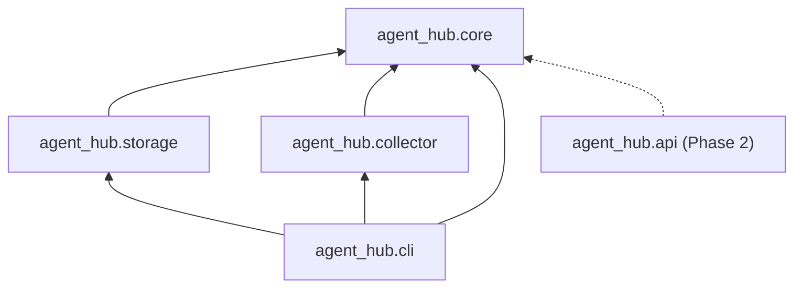
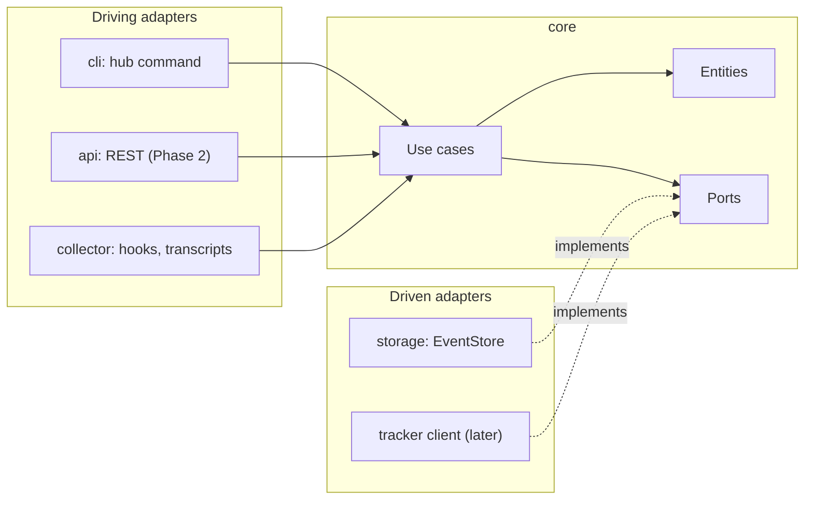

# Architecture

How the agent-hub code is organized and where new code goes. The product itself is described in [SPEC.md](SPEC.md); the
decisions behind this layout are [ADR 0001](adr/0001-uv-workspace-with-namespace-packages.md) (workspace),
[ADR 0002](adr/0002-lean-hexagonal-architecture.md) (hexagonal architecture) and
[ADR 0003](adr/0003-persistence-sqlalchemy-core-and-alembic.md) (persistence).

## Packages

The repo is a uv workspace. The root `pyproject.toml` is virtual (no `[project]` table); every member lives under
`packages/` and ships one distribution. All Python code shares the implicit namespace package `agent_hub`: there is no
`agent_hub/__init__.py` anywhere.

| Package dir | Distribution | Module root | Role |
|---|---|---|---|
| `packages/core` | `agent-hub-core` | `agent_hub.core` | Domain: entities, canonical event, Pydantic schemas, use cases, ports; test support in `agent_hub.core.testing` |
| `packages/storage` | `agent-hub-storage` | `agent_hub.storage` | Storage adapter: SQLAlchemy Core tables (`agent_hub.storage.db.metadata`), the SQLite `EventStore` and the Alembic migrations, shipped inside the package (`agent_hub/storage/migrations/`) |
| `packages/collector` | `agent-hub-collector` | `agent_hub.collector` | Collector adapter: receives hook events and transcripts and feeds them to core |
| `packages/cli` | `agent-hub-cli` | `agent_hub.cli` | The `hub` command (Typer); entry point `agent_hub.cli.main:app` |
| `packages/agent-hub` | `agent-hub` | `agent_hub_meta` (placeholder) | Meta-package: depends on the four above and declares the `hub` script, so `uv tool install agent-hub` installs everything |

Later, in Phase 2: `packages/api` (`agent_hub.api`, FastAPI, see [API.md](API.md)) and `apps/web` (React). They do not
exist yet.

Each package has the same shape:

```
packages/<pkg>/
  pyproject.toml
  src/agent_hub/<pkg>/        # no __init__.py in src/agent_hub/
  tests/unit/                 # mirrors src/agent_hub/<pkg>/
  tests/contract/             # contract suites run against this package's adapter (when it has one)
  tests/integration/          # real SQLite files under tmp_path
```

Repo tooling (the layout checker, coverage floors, PR-title lint, the pytest level plugin) lives in `scripts/`, with its
tests in the root `tests/unit/scripts/`. The root `tests/e2e/` holds the end-to-end tests. See [TESTING.md](TESTING.md).

**Python and uv.** The workspace targets Python 3.14 (`.python-version` = `3.14`, `requires-python = ">=3.14"`); 3.14 is
the first release whose stdlib has `uuid.uuid7`, which the API ids use. uv must be 0.9.0 or newer
(`required-version = ">=0.9.0"`): older uv releases offer only 3.14 release candidates, and an rc already installed on
the machine can satisfy `3.14`. Fix with `uv self update` and `uv python install 3.14`. CI pins uv 0.12.19.

## Dependency rule

1. Every package may depend on `core`.
2. `core` depends on nothing internal, and not on the adapter libraries `sqlalchemy`, `alembic` or `typer`.
3. `agent_hub.cli` is the composition root ([ADR 0008](adr/0008-cli-as-composition-root.md)): it may import the adapter
   packages `storage` and `collector` to build adapters and pass them to core use cases. Nothing imports `cli`.
4. The adapter packages (`storage`, `collector`) never import each other; they depend only on `core`.



import-linter enforces the rule with the contracts in `.importlinter` (`root_packages = agent_hub`,
`include_external_packages = True`):

- `core imports nothing internal` (forbidden): `agent_hub.core` must not import `agent_hub.storage`,
  `agent_hub.collector`, `agent_hub.cli`, `sqlalchemy`, `alembic` or `typer`.
- `cli is the composition root` (layers): `agent_hub.cli` above the independent sibling layers
  `agent_hub.storage | agent_hub.collector`. A lower layer importing a higher one, or one sibling importing the other,
  breaks it.

Run it with `make imports` (part of `make check`). A broken contract fails with its name followed by `BROKEN`.

Wiring happens only in the composition root: a CLI command builds the adapters it needs (for example the `storage`
implementation of `EventStore`) and passes them to the use case as port implementations. Use cases and adapters never
construct other adapters. In Phase 2, `agent_hub.api` becomes a second composition root and joins `cli` in the top
layer. The meta-package `agent-hub` only bundles the distributions for installation; it holds no wiring.

Adding a package: create `packages/<pkg>/` with the shape above, then register it in `mypy.ini` (`files` and
`mypy_path`), in both `.importlinter` contracts (core's forbidden list and the layers list) and in the Makefile `COV`
list. The layout checker rule `package-registered` fails `make check-fast` until all of these are done.

## Hexagonal layout

`core` is the hexagon; everything else is an adapter around it.

- **Entities** (in core): frozen Pydantic models for the domain concepts of the SPEC glossary (Project, Hub, Repo,
  Workflow, WorkflowRun, Agent, Session, Brain, Learning) and the canonical event.
- **Use cases** (in core): one class or function per operation, named verb + object (`IngestTranscript`,
  `GenerateHub`). They take ports as arguments and return domain models.
- **Ports** (in core): interfaces for what the SPEC expects to swap: `EventStore` (SQLite now, Postgres later),
  `TrackerClient` (Linear first), `TranscriptSource` (Claude Code first). No port where no swap is expected.
- **Adapters** (other packages): `storage` implements `EventStore`; `collector` turns hook events and transcripts into
  canonical events and calls the ingestion use case; `cli` (and later `api`) parse input, call ONE use case and render
  the result. Adapters translate external errors into the package's domain exceptions at the boundary.
- **Errors**: `agent_hub.core.errors.AgentHubError` is the root; each package has its own `errors.py` with subclasses
  (`StorageError`, `CollectorError`, …).



The first port is `EventStore` (`agent_hub.core.events.event_store`): an append-only store of canonical events,
idempotent by `(source, source_id)`, that appends a batch all or nothing. The use case `IngestEvents` calls it. Its fake is
`InMemoryEventStore` (`agent_hub.core.testing.fakes`), and its contract suite `EventStoreContract`
(`agent_hub.core.testing.contracts`) runs against both the fake and `SqliteEventStore` (`agent_hub.storage.event_store`).

`hub collect` wires them: the collector parses JSON Lines into events, `open_event_store(path)` upgrades the SQLite file
to the latest migration (under a write lock) and returns the store, and `IngestEvents` appends the batch. The database
file is `--db PATH`, else the environment variable `AGENT_HUB_DB`, else `$XDG_DATA_HOME/agent-hub/agent-hub.db` (only
when `XDG_DATA_HOME` is absolute), else `$HOME/.local/share/agent-hub/agent-hub.db` (`agent_hub.cli.database_path`).
SQLite runs in WAL mode, and the engine opens a connection per use (no pool).

## Where does this code go

Paths are under `packages/<pkg>/src/agent_hub/<pkg>/` unless shown in full. `<area>` is a domain area folder such as
`ingestion/`; tests mirror the same path under `tests/unit/`.

| Code | Where | Notes |
|---|---|---|
| Entity (domain model) | `core`: `<area>/<entity>.py` | Frozen Pydantic model; no I/O |
| Use case | `core`: `<area>/<verb_object>.py`, e.g. `ingestion/ingest_transcript.py` | Named verb + object; depends on ports only |
| Port | `core`: `<area>/<port>.py`, e.g. `events/event_store.py` | Only where a swap is expected (ADR 0002) |
| Domain exception | the package's `errors.py` | Subclass of the package's root error, itself under `AgentHubError` |
| Adapter | the adapter package, e.g. `storage/<port>.py` | Implements a core port; translates external errors |
| Table | `storage`: `db.py` (`metadata`) | The single place tables are declared |
| Migration | `packages/storage/src/agent_hub/storage/migrations/versions/<NNNN>_<slug>.py` | Created with `python -m agent_hub.storage.migration revision --rev-id <NNNN>`; the Alembic config is built in code (`agent_hub.storage.migration.alembic_config`); see [CONTRIBUTING.md](CONTRIBUTING.md) |
| CLI command | `cli`: `main.py` or a command module registered on the Typer `app` | Parses input, calls one use case |
| Wiring adapters to use cases | `agent_hub.cli` (composition root, [ADR 0008](adr/0008-cli-as-composition-root.md)) | Builds the adapters and passes them to the use case as ports |
| API route | `api` (Phase 2) | Thin: validate, call ONE use case, map the response ([API.md](API.md)) |
| Fake of a port | `core`: `testing/fakes.py` (`agent_hub.core.testing.fakes`) | In-memory; checked by the port's contract suite |
| Builder of test data | `core`: `testing/builders.py` (`agent_hub.core.testing.builders`) | Synthetic data only |
| Port contract suite | `core`: `testing/contracts.py` (`agent_hub.core.testing.contracts`) | Run from each implementation's `tests/contract/` |
| Repo tooling | `scripts/<verb_object>.py`, tests in `tests/unit/scripts/` | Run as `python -m scripts.<name>` when it imports another script |

Module and folder names never use `utils`, `util`, `helpers`, `helper`, `common` or `misc` (layout checker rule
`forbidden-module`); name the module after what it does.
