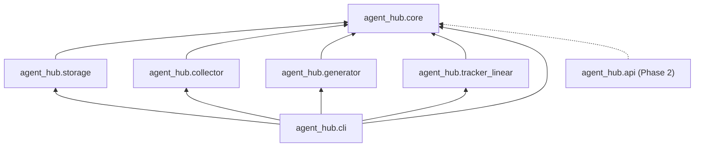
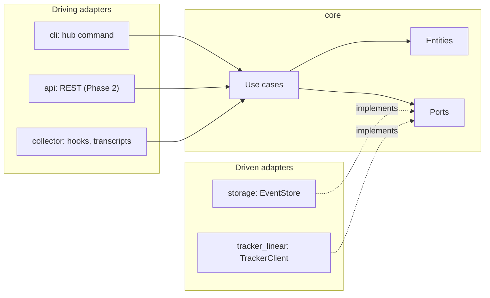

# Architecture

How the agent-hub code is organized and where new code goes. The product itself is described in [SPEC.md](SPEC.md); the
decisions behind this layout are [ADR 0001](adr/0001-uv-workspace-with-namespace-packages.md) (workspace),
[ADR 0002](adr/0002-lean-hexagonal-architecture.md) (hexagonal architecture) and
[ADR 0003](adr/0003-persistence-sqlalchemy-core-and-alembic.md) (persistence); the tracker port is
[ADR 0014](adr/0014-tracker-port-linear-graphql.md). The Phase 1 to 4 designs (hub config,
generator, doctor, domain model, events, workflows) are indexed in [design/README.md](design/README.md).

## Packages

The repo is a uv workspace. The root `pyproject.toml` is virtual (no `[project]` table); every member lives under
`packages/` and ships one distribution. All Python code shares the implicit namespace package `agent_hub`: there is no
`agent_hub/__init__.py` anywhere.

| Package dir | Distribution | Module root | Role |
|---|---|---|---|
| `packages/core` | `agent-hub-core` | `agent_hub.core` | Domain: entities, canonical event, Pydantic schemas, use cases, ports, the one JSON byte form and its parser (`agent_hub.core.json_form`: `dump_json`, `load_json_bytes`), the rendered-hub contract types and `hub.lock` (`agent_hub.core.hub_files`: `RenderedFile`, `RenderedLink`, `RenderedHub`; the lock model `HubLock` with `build_hub_lock`, `lock_bytes` and the reader `read_hub_lock`; the tree snapshot types; the extension inputs `ExtensionInputs` with `extension_inputs_from`, `entry_name_key` and `REFUSED_KEYS`, the keys a `*.project.json` sibling may not set (`extension_inputs.py`); the init planner `plan_init`, the sync planner `plan_sync` and the adopt planner `plan_adopt`); the tracker port `TrackerClient` and the `Issue` value object (`agent_hub.core.tracker.tracker_client`); the pure workspace rules in `agent_hub.core.workspace` (`worktree_name.py`: the task worktree name `<team>-<n>[-<desc>]` and its branch; `branch_pattern.py`: a branch rendered from the `branch` convention; `shown_conventions.py`: the convention shapes and examples the rendered texts show and doctor skips; `brief_text.py`: the session brief's text; `agent_launch.py`: Claude Code's argv, the context text and the settings JSON); the pure rules of `hub next` and `hub run` in `agent_hub.core.runner` (`ready_list.py`, `session_prompt.py`, `verdict.py`, `run_texts.py`, `title_pattern.py`, `run_record.py`, `report_writes.py`); the pure rules of `hub bench` in `agent_hub.core.bench` (`bench_cases.py`: the cases file and its checks; `bench_plan.py`: jobs, waves and the budget stop; `bench_session.py`: the session settings, argv and records; `bench_summary.py`: the summary and `--validate`'s lines); the doctor in `agent_hub.core.doctor` (the finding, rule and snapshot types, the runner `run_rules.py` that selects, runs, retunes and sorts rules, the `registry.py` of released rules, and the rules, e.g. `config_rules.py`); test support in `agent_hub.core.testing` |
| `packages/storage` | `agent-hub-storage` | `agent_hub.storage` | Storage adapter: SQLAlchemy Core tables (`agent_hub.storage.db.metadata`), the SQLite `EventStore` and the Alembic migrations, shipped inside the package (`agent_hub/storage/migrations/`) |
| `packages/collector` | `agent-hub-collector` | `agent_hub.collector` | Collector adapter: receives hook events and transcripts and feeds them to core |
| `packages/generator` | `agent-hub-generator` | `agent_hub.generator` | Hub generator: the hub templates as package data (base rules, brain skeleton, the base plugin `plugin/hub-workflow/` with its hooks and their stdlib reader, the seeded project plugin under the project's name, the transcript and retro scripts), the `@@` renderer, the JSON built in code (`built_json.py`: `.claude/settings.json`, the project settings and manifest, and `base_hooks_block`, the release's base hooks for `hub doctor`), the classification registry and `render_hub(config, extensions)`, which returns a `RenderedHub` (files and plugin links; `project_json_siblings` names the `*.project.json` it merges), with `json_merge.py` (`merge_json`, the strict merge of a `*.project.json` sibling) and `links.py` (`plugin_links`, `project_links` for the project's agents and skills); and the file adapter, never following a link: `hub_tree.py` reads a hub tree, one root entry (`read_root_entry`) or only the planned paths (`read_planned_tree`), `doctor_tree.py` lists and reads a tree for `hub doctor` (`read_doctor_tree`: `git ls-files` or a walk, plus fixed paths by path), `file_adapter.py` writes a plan through temporary files and applies a sync plan with its deletes through one held root (`apply_sync`) ([ADR 0011](adr/0011-templates-as-package-data.md)) |
| `packages/tracker_linear` | `agent-hub-tracker-linear` | `agent_hub.tracker_linear` | Tracker adapter: `LinearGraphqlTrackerClient` (`graphql.py`) implements `TrackerClient` over Linear's GraphQL API with the standard library (`urllib`, no redirects followed, a 30 s timeout per socket operation); the key comes only from `LINEAR_API_KEY`, read at call time ([ADR 0014](adr/0014-tracker-port-linear-graphql.md)); `McpTrackerClient` (`mcp.py`) implements it over the user's Linear MCP server, each operation one or two headless `claude -p` calls run by `claude_process.py` (`run_claude`, the caller's process group, a timeout kills the child), with the request lines, prompts, per-call tool lists and reply checks in `mcp_protocol.py` ([ADR 0015](adr/0015-linear-mcp-tracker-transport.md)) |
| `packages/cli` | `agent-hub-cli` | `agent_hub.cli` | The `hub` command (Typer); entry point `agent_hub.cli.main:app`. The composition root: `command_exits` (the exit helpers the hub commands share), `sync_command` (`hub sync`: load, render, read, plan, apply), `sync_report` (its change lines and conflict report), `sync_steps` (the lock read, tree read, render and apply `hub sync` and `--adopt` share), `adopt_command` (`hub sync --adopt`: plan, apply the settled paths, list the rest) and `adopt_report` (its listing, refusal and way-out lines), `doctor_command` (`hub doctor`: read the config and the tree, run the rules, exit 0, 1 or 2) and `doctor_report` (its finding lines, totals and JSON), `tracker_client` (`resolve_tracker_client`: the `TrackerClient` adapter for `tracker.kind` and `tracker.transport`), `worktree_command` (`hub worktree`: one task's worktrees in every repo, their setup and teardown scripts, `--remove`), `worktree_steps` (the worktree steps `hub worktree` and `hub run` share, raising `WorktreeError`), `next_command` (`hub next`: one `list_ready`, one line per issue), `run_command` (`hub run`: options, usage checks, the key check, the dry run), `run_steps` (the live stages and the report), `run_children` (the children's argv and environments, the dry run's lines), `run_report` (the tracker writes in order, stopping at the first failure), `run_log` (the run id, the records and the inbox line), `push_guard` (the git config keys and the origin the fetch and the push refuse), `bench_command` (`hub bench`: options, usage checks, the module check, `--validate` or a run) and `bench_steps` (read the cases, the bench worktrees, the lock, the grades and the run loop), `brief_command` (`hub brief`: reads `now.md`, the journal, git in each checkout and `gh` at once, then prints core's brief text), `agent_command` (`hub agent`: writes the repos' context file, then `exec`s `claude` with every repo attached; `PassThroughCommand` keeps every argument), `child_process` (`run_child` and `stream_child`, the one runner of git and scripts, and `git_env`, which drops git's location variables) and `hub_root` (`hub_root_or_exit`: the hub from `AGENT_HUB_ROOT` or the cwd; `main_checkout`: the main checkout when the hub is a worktree of its repo) |
| `packages/agent-hub` | `agent-hub` | `agent_hub_meta` (placeholder) | Meta-package: depends on the six above and declares the `hub` script, so `uv tool install agent-hub` installs everything |

Later, in Phase 2: `packages/api` (`agent_hub.api`, FastAPI, see [API.md](API.md)) and `apps/web` (React). They do not
exist yet.

Each package has the same shape:

```
packages/<pkg>/
  pyproject.toml
  src/agent_hub/<pkg>/        # no __init__.py in src/agent_hub/
  tests/unit/                 # mirrors src/agent_hub/<pkg>/
  tests/contract/             # contract suites run against this package's adapter (when it has one)
  tests/integration/          # real SQLite files under tmp_path
```

Repo tooling (the layout checker, coverage floors, PR-title lint, the release check, the pytest level plugin) lives in
`scripts/`, with its tests in the root `tests/unit/scripts/`. The root `tests/e2e/` holds the end-to-end tests. See
[TESTING.md](TESTING.md).

**Python and uv.** The workspace targets Python 3.14 (`.python-version` = `3.14`, `requires-python = ">=3.14"`); 3.14 is
the first release whose stdlib has `uuid.uuid7`, which the API ids use. uv must be 0.9.0 or newer
(`required-version = ">=0.9.0"`): older uv releases offer only 3.14 release candidates, and an rc already installed on
the machine can satisfy `3.14`. Fix with `uv self update` and `uv python install 3.14`. CI pins uv 0.12.19.

## Dependency rule

1. Every package may depend on `core`.
2. `core` depends on nothing internal, and not on the adapter libraries `sqlalchemy`, `alembic` or `typer`.
3. `agent_hub.cli` is the composition root ([ADR 0008](adr/0008-cli-as-composition-root.md)): it may import the adapter
   packages `storage`, `collector`, `generator` and `tracker_linear` to build adapters and pass them to core use cases.
   Nothing imports `cli`.
4. The adapter packages (`storage`, `collector`, `generator`, `tracker_linear`) never import each other; they depend
   only on `core`.



import-linter enforces the rule with the contracts in `.importlinter` (`root_packages = agent_hub`,
`include_external_packages = True`):

- `core imports nothing internal` (forbidden): `agent_hub.core` must not import `agent_hub.storage`,
  `agent_hub.collector`, `agent_hub.generator`, `agent_hub.tracker_linear`, `agent_hub.cli`, `sqlalchemy`, `alembic` or
  `typer`.
- `cli is the composition root` (layers): `agent_hub.cli` above the independent sibling layers
  `agent_hub.storage | agent_hub.collector | agent_hub.generator | agent_hub.tracker_linear`. A lower layer importing a
  higher one, or one sibling importing another, breaks it.

Run it with `make imports` (part of `make check`). A broken contract fails with its name followed by `BROKEN`.

Wiring happens only in the composition root: a CLI command builds the adapters it needs (for example the `storage`
implementation of `EventStore`) and passes them to the use case as port implementations. Use cases and adapters never
construct other adapters. In Phase 2, `agent_hub.api` becomes a second composition root and joins `cli` in the top
layer. The meta-package `agent-hub` only bundles the distributions for installation; it holds no wiring.

Adding a package: create `packages/<pkg>/` with the shape above, then register it in `mypy.ini` (`files` and
`mypy_path`), in both `.importlinter` contracts (core's forbidden list and the layers list) and in the Makefile `COV`
list. The layout checker rule `package-registered` fails `make check-fast` until all of these are done. Then add it to
the PR-title scopes (`SCOPES` in `scripts/check_pr_title.py` and the list in CONTRIBUTING.md) and create its
`pkg:<name>` area label; the `tracker_*` adapters share the `tracker` scope and the `pkg:tracker` label.

## Hexagonal layout

`core` is the hexagon; everything else is an adapter around it.

- **Entities** (in core): frozen Pydantic models for the domain concepts of the SPEC glossary (Project, Hub, Repo,
  Workflow, WorkflowRun, Agent, Session, Brain, Learning) and the canonical event.
- **Use cases** (in core): one class or function per operation, named verb + object (`IngestTranscript`,
  `GenerateHub`). They take ports as arguments and return domain models.
- **Ports** (in core): interfaces for what the SPEC expects to swap: `EventStore` (SQLite now, Postgres later),
  `TrackerClient` (Linear first), `TranscriptSource` (Claude Code first). No port where no swap is expected.
- **Adapters** (other packages): `storage` implements `EventStore`; `tracker_linear` implements `TrackerClient`;
  `collector` turns hook events and transcripts into canonical events and calls the ingestion use case; `cli` (and later
  `api`) parse input, call ONE use case and render the result; `generator` renders a hub's files and links from
  `HubConfig` and the extension inputs (and reads a hub tree and applies core's init and sync plans to disk) and
  implements no port ([ADR 0011](adr/0011-templates-as-package-data.md)). Adapters translate external errors into the
  package's domain exceptions at the boundary.
- **Errors**: `agent_hub.core.errors.AgentHubError` is the root; each package has its own `errors.py` with subclasses
  (`StorageError`, `CollectorError`, `GeneratorError`, …). A port's own failure lives in core, e.g. `TrackerError`,
  which every `TrackerClient` adapter raises.



The first port is `EventStore` (`agent_hub.core.events.event_store`): an append-only store of canonical events,
idempotent by `(source, source_id)`, that appends a batch all or nothing. The use case `IngestEvents` calls it. Its fake is
`InMemoryEventStore` (`agent_hub.core.testing.fakes`), and its contract suite `EventStoreContract`
(`agent_hub.core.testing.contracts`) runs against both the fake and `SqliteEventStore` (`agent_hub.storage.event_store`).

`hub collect` wires them: the collector parses JSON Lines into events, `open_event_store(path)` upgrades the SQLite file
to the latest migration (under a write lock) and returns the store, and `IngestEvents` appends the batch. The database
file is `--db PATH`, else the environment variable `AGENT_HUB_DB`, else `$XDG_DATA_HOME/agent-hub/agent-hub.db` (only
when `XDG_DATA_HOME` is absolute), else `~/.local/share/agent-hub/agent-hub.db`, where `~` is `HOME` when it is
non-empty and absolute, else the account's home from the password database; with neither, `hub collect` exits 1 asking
for `--db` or `AGENT_HUB_DB` (`agent_hub.cli.database_path`). SQLite runs in WAL mode, and the engine opens a connection
per use (no pool).

The second port is `TrackerClient` (`agent_hub.core.tracker.tracker_client`): list the ready issues of a team, get an
issue, move its state, add or remove a label and comment, each failure a `TrackerError`. Its fake is
`InMemoryTrackerClient`, and its contract suite `TrackerClientContract` runs against the fake,
`LinearGraphqlTrackerClient` (`agent_hub.tracker_linear.graphql`) over an in-process fake of Linear's API, and
`McpTrackerClient` (`agent_hub.tracker_linear.mcp`) over an injected runner that plays the model. The CLI picks the
adapter from `tracker.kind` and `tracker.transport` with `resolve_tracker_client` (`agent_hub.cli.tracker_client`);
`hub next` and `hub run` resolve it, after checking the key for transport `"api"`.

## Where does this code go

Paths are under `packages/<pkg>/src/agent_hub/<pkg>/` unless shown in full. `<area>` is a domain area folder such as
`ingestion/`; tests mirror the same path under `tests/unit/`.

| Code | Where | Notes |
|---|---|---|
| Entity (domain model) | `core`: `<area>/<entity>.py` | Frozen Pydantic model; no I/O |
| Use case | `core`: `<area>/<verb_object>.py`, e.g. `ingestion/ingest_transcript.py` | Named verb + object; depends on ports only |
| Port | `core`: `<area>/<port>.py`, e.g. `events/event_store.py` | Only where a swap is expected (ADR 0002) |
| Domain exception | the package's `errors.py` | Subclass of the package's root error, itself under `AgentHubError`; an adapter that only raises its port's core error (e.g. `TrackerError`) needs no `errors.py` |
| Adapter | the adapter package, e.g. `storage/<port>.py` | Implements a core port; translates external errors |
| Table | `storage`: `db.py` (`metadata`) | The single place tables are declared |
| Migration | `packages/storage/src/agent_hub/storage/migrations/versions/<NNNN>_<slug>.py` | Created with `python -m agent_hub.storage.migration revision --rev-id <NNNN>`; the Alembic config is built in code (`agent_hub.storage.migration.alembic_config`); see [CONTRIBUTING.md](CONTRIBUTING.md) |
| CLI command | `cli`: `main.py` or a command module registered on the Typer `app` | Parses input, calls one use case |
| Wiring adapters to use cases | `agent_hub.cli` (composition root, [ADR 0008](adr/0008-cli-as-composition-root.md)) | Builds the adapters and passes them to the use case as ports |
| API route | `api` (Phase 2) | Thin: validate, call ONE use case, map the response ([API.md](API.md)) |
| Fake of a port | `core`: `testing/fakes.py` (`agent_hub.core.testing.fakes`) | In-memory; checked by the port's contract suite |
| Builder of test data | `core`: `testing/builders.py` (`agent_hub.core.testing.builders`) | Synthetic data only |
| Port contract suite | `core`: `testing/contracts.py` (`agent_hub.core.testing.contracts`) | Run from each implementation's `tests/contract/` |
| Hub template | `generator`: `templates/<output path, no leading dot>.tmpl` plus a `registry.py` entry; a JSON file whose value comes from the config has a builder in `built_json.py` instead of a template | Package data read with `importlib.resources`; `@@{key}` placeholders from `placeholders.py`; built JSON is written by `dump_json` (`agent_hub.core.json_form`, re-exported by the generator's `json_form`) |
| Doctor rule | `core`: `doctor/<area>_rules.py` plus a `registry.py` entry | A pure function over the snapshot; its contract is in [design/hub-doctor.md](design/hub-doctor.md) |
| Repo tooling | `scripts/<verb_object>.py`, tests in `tests/unit/scripts/` | Run as `python -m scripts.<name>` when it imports another script |

Module and folder names never use `utils`, `util`, `helpers`, `helper`, `common` or `misc` (layout checker rule
`forbidden-module`); name the module after what it does.
