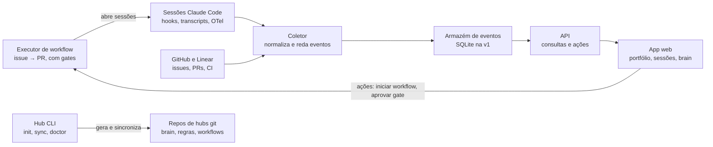

# Spec inicial — Plataforma de hubs e agentes

27/09/2026 · José Henrique Roquette. Fonte viva: documento no claude.ai; este arquivo é a cópia versionada.

## Visão e problema

A plataforma transforma o que o `loki-trader-hub` faz à mão para um projeto em um produto que monta, opera e observa hubs de agentes de IA para N projetos. Ela também gerencia a si mesma e o próprio Loki Trader.

Hoje o hub do Loki Trader já reúne as peças certas: memória versionada (`brain/`), regras cross-repo (`AGENTS.md`), launcher multi-repo (`agent`), plugin de workflow com agentes de entrega, runner que leva uma issue do Linear até PR (`agent_runner.py`), mineração de transcripts, retro e benchmark. O problema é que tudo está acoplado a um projeto:

- **Não reaproveita.** Os nomes dos repos, o time do Linear, as regras e os caminhos estão fixos no código. Um projeto novo começa do zero.
- **Não enxerga.** O que os agentes fazem, decidem e aprendem fica espalhado em transcripts JSONL, logs em `.agent-runs/`, `brain/_inbox/` e PRs. Não há um lugar para ver isso junto, ao vivo ou ao longo do tempo.
- **Não governa.** O workflow (plano → aprovação → código → CI → PR) está implícito em regras de texto, hooks e scripts. Ele não pode ser definido, versionado ou comparado entre projetos.

## Objetivos e não-objetivos

O sucesso da v1 é recriar o `loki-trader-hub` pela plataforma sem perder capacidade e ver numa tela o que cada agente fez numa sessão.

**Objetivos**

1. **Criar hubs genéricos.** Um comando monta o hub de qualquer projeto (1 a N repos) com brain, regras, launcher, plugin e scripts.
2. **Definir workflows como dado.** Etapas, gates, aprovadores e limites (turnos, custo) ficam versionados no hub, e não espalhados em texto e scripts.
3. **Observar agentes.** Mostrar ao vivo e no histórico o que cada sessão fez: tarefa, repo, ferramentas usadas, arquivos tocados, decisões e custo.
4. **Tornar o conhecimento visível.** Mostrar o que o agente recebe de contexto (regras, brain, memória), o que aprendeu (learnings, inbox) e de onde veio cada item.
5. **Auditar o raciocínio.** Reconstituir por que uma decisão foi tomada a partir do transcript: mensagens, resumos de raciocínio e tool calls.

**Não-objetivos (v1)**

- Não é um novo agente nem um runtime de LLM. A plataforma orquestra e observa o Claude Code (e depois outros), não o substitui.
- Não é multiusuário nem SaaS. A v1 é local-first, para um dono.
- Não edita o brain sozinha. Mantém a regra do hub atual: agentes propõem em `_inbox/`, e o humano decide.
- Não promete ler a "mente" do modelo. Ela mostra o que o transcript registra, nada além.

## Conceitos centrais

O modelo tem oito entidades. Todas já existem de forma implícita no Loki Trader, e a plataforma só lhes dá nome e esquema.

| Conceito | O que é | Equivalente hoje no Loki Trader |
| --- | --- | --- |
| Projeto | Um produto com 1 a N repos e um rastreador de tarefas | Loki Trader (time `LOK` no Linear) |
| Hub | Repo de controle do projeto: regras, brain, workflows, plugin, scripts | `loki-trader-hub` |
| Repo | Repositório de código gerido pelo hub, com o seu `AGENTS.md` | `tradeSentinel`, `loki-trader-ui` |
| Workflow | Sequência de etapas com gates, aprovadores e limites | Estados do `agent_runner.py` e o `/feature` do plugin |
| Agente | Um papel com instruções, ferramentas e modelo | Agentes em `plugin/loki-workflow/agents/` |
| Sessão | Uma execução concreta de um agente, com transcript, custo e resultado | Transcripts JSONL e `.agent-runs/*.jsonl` |
| Brain | Conhecimento curado e versionado, com proveniência | `brain/` (index, now, decisions, learnings…) |
| Learning | Algo aprendido numa sessão, proposto e depois aceito ou rejeitado | `brain/_inbox/` → `brain/learnings/` e memória auto |

## Camada 1: gerador de hubs (CLI)

Uma CLI cria e mantém hubs a partir de um arquivo de configuração do projeto. Tudo o que hoje é específico do Loki vira parâmetro ou módulo opcional.

```
hub init <projeto> --repos org/backend,org/frontend --tracker linear:LOK
hub sync        # reaplica templates sem sobrescrever o que o projeto customizou
hub doctor      # checa regras, links, referências mortas e tamanho das instruções
```

**O que extrair do `loki-trader-hub`**

| Peça atual | Vira na plataforma | Genérico ou módulo |
| --- | --- | --- |
| `brain/` (index, now, decisions, learnings, playbooks, journal, `_inbox/`, `auto/`) | Template de brain com frontmatter e proveniência | Genérico |
| `AGENTS.md`/`CLAUDE.md` com regras cross-repo | Template com regras base (autoria, worktree, sem push em `main`) e regras do projeto | Genérico + regras do projeto |
| `agent` (launcher com `--add-dir` e AGENTS.md anexados) | Launcher gerado a partir da lista de repos | Genérico |
| `scripts/worktree.sh` | Worktrees isolados por tarefa, com portas e `.env` próprios | Genérico, com hooks por stack |
| `scripts/brief.py` | Brief de sessão (now, journal, estado de git/PR/CI) | Genérico |
| `scripts/agent_runner.py` | Executor de workflow (issue → PR como máquina de estados) | Genérico, lendo o workflow como dado |
| `mine_transcripts.py`, `recall_transcripts.py`, `retro_metrics.py` | Ingestão e análise da camada 2 | Genérico |
| `bench.py` | Benchmark de configuração de agente em issues fechadas | Módulo |
| `agent_config_lint.py`, `features_check.py` | `hub doctor` e validação de features | Genérico |
| `plugin/loki-workflow/` (agents, skills, hooks) e marketplace | Plugin base da plataforma + plugin do projeto | Genérico + do projeto |
| `contract-sync.sh` (OpenAPI backend → frontend) | Receita de contrato entre repos | Módulo |
| Red-chain, Decimal, paper/testnet | Regras do domínio Loki | Fica no projeto |

Regra de desenho: o hub gerado continua sendo só arquivos versionados num repo privado do GitHub, acessível só aos donos. Assim ele funciona no terminal, nas sessões na nuvem e sem a camada 2 rodando.

## Camada 2: plano de controle e observabilidade

Um app web lê os hubs e os eventos dos agentes e responde a cinco perguntas, uma por visão.

| Visão | Pergunta que responde | Conteúdo |
| --- | --- | --- |
| Portfólio | Como estão meus projetos? | Hubs, repos, tarefas em andamento, PRs abertos, CI, custo da semana |
| Workflows | Como o trabalho deve fluir? | Editor e visualização das etapas e gates; em que etapa cada tarefa está; onde trava |
| Sessões ao vivo | O que os agentes estão fazendo agora? | Sessões ativas por repo e tarefa, última ação, turnos e custo acumulado, aprovações pendentes |
| Linha do tempo da sessão | Por que o agente fez isso? | Mensagens, resumos de raciocínio, tool calls, arquivos e diffs, decisões marcadas e o resultado final |
| Conhecimento | O que ele sabe e o que aprendeu? | Contexto carregado na sessão (regras, brain, memória), learnings propostos, triagem do inbox, evolução ao longo do tempo |

**Decisões como objeto.** Uma decisão é um trecho da sessão com escolha, alternativas descartadas e justificativa. Na v1 ela é extraída do transcript. Depois, os agentes podem registrá-la explicitamente por uma skill ou hook (`/decide`).

**Aprender com proveniência.** Cada item do brain e cada learning guarda a sessão de origem, o autor (humano ou agente) e o status. A visão de conhecimento mostra o caminho sessão → proposta → aceito → regra e mede se a regra reduziu a falha que a motivou (o que o `mine_transcripts.py` e o `retro_metrics.py` já começam a fazer).

**Ações, não só leitura (depois da v1).** Iniciar um workflow numa issue, aprovar um gate, pausar ou cancelar uma sessão, aceitar um learning.

## Fontes de dados e modelo de eventos

Quase todos os dados já existem. A plataforma normaliza cinco fontes num único fluxo de eventos por sessão.

| Fonte | O que traz | Latência |
| --- | --- | --- |
| Hooks do Claude Code | Início e fim de sessão, cada tool use, prompts, pedidos de permissão | Tempo real |
| Transcripts (`~/.claude/projects/*.jsonl`) | Mensagens completas, raciocínio registrado, tool calls e resultados | Após cada turno |
| OpenTelemetry do Claude Code | Tokens, custo, duração, erros | Tempo real |
| Logs do executor de workflow (hoje `.agent-runs/`) | Etapa, gate, resultado, motivo de falha | Por etapa |
| GitHub e rastreador (Linear) | Issues, PRs, commits, CI, review | Polling ou webhook |

**Evento canônico** (rascunho): `{projeto, repo, sessão, agente, workflow, etapa, tipo, timestamp, payload, origem}`. Os tipos iniciais são `session.start`, `session.end`, `tool.call`, `tool.result`, `message`, `reasoning`, `decision`, `gate.request`, `gate.result`, `learning.proposed` e `learning.accepted`.

**Privacidade e redação.** Transcripts podem conter segredos e dados pessoais. A ingestão reda padrões de chave e token antes de gravar, e os dados ficam na máquina na v1.

## Arquitetura proposta

A v1 roda inteira na máquina do dono: um coletor, um armazém de eventos e um app web, além da CLI que gera os hubs.



As sessões e o GitHub/Linear alimentam o coletor, e o app web lê tudo pela API. As ações do app voltam ao executor de workflow. A API também lê os repos de hubs para mostrar brain, regras e workflows.

- **Stack sugerida:** Python (FastAPI + Pydantic) no backend e React no front, como no Loki Trader, para reaproveitar os scripts atuais e a experiência do time. O armazém começa em SQLite e migra para Postgres quando houver multiusuário.
- **Hooks como sensor:** o hub gerado instala hooks do Claude Code que enviam eventos ao coletor local. Sem o coletor rodando, os hooks falham em silêncio e a sessão segue normal.
- **Adaptadores:** Claude Code é o primeiro. Outros agentes (Codex, Cursor) entram como adaptadores que emitem o mesmo evento canônico.

## MVP e fases

O MVP vai até a Fase 2: gerar hubs a partir do Loki e ver as sessões dos agentes numa tela. Cada fase só começa quando o gate da anterior passa.

| Fase | Conteúdo | Gate para a próxima |
| --- | --- | --- |
| 0 · Fundação (MVP) | Repo novo no GitHub, spec aprovada, esqueleto da CLI e do coletor | O próprio hub gerado pela CLI |
| 1 · Gerador de hubs (MVP) | Extrair brain, regras, launcher, worktrees, brief e plugin; `hub init`, `sync` e `doctor` | Hub do Loki recriado, `make check` e bench iguais |
| 2 · Observabilidade read-only (MVP) | Coletor de hooks e transcripts, linha do tempo da sessão, portfólio e sessões ao vivo | Sessões dos 2 projetos ao vivo e no histórico |
| 3 · Conhecimento e decisões | Proveniência no brain, triagem do inbox na UI, decisões extraídas, métricas de aprendizado | Um learning rastreado da sessão até a regra |
| 4 · Workflows como dado e ações | Executor genérico lendo o workflow, gates aprovados pela UI, adaptadores para outros agentes | — |

A ordem segue o dogfooding: o primeiro hub gerado é o da própria plataforma, e o segundo substitui o `loki-trader-hub`. Workflows editáveis ficam para depois porque dependem de a observação já mostrar onde o fluxo atual trava.

## Decisões em aberto

As recomendações valem como ponto de partida.

| Decisão | Opções | Recomendação |
| --- | --- | --- |
| Nome e onde vive | **Decidido:** `agent-hub`, repo privado na conta pessoal `jroquette` | — |
| Escopo de agentes | Só Claude Code ou vários desde o início | Só Claude Code na v1, com o evento canônico pronto para adaptadores |
| Onde roda | Local-first ou serviço hospedado | Local-first na v1. Hospedado só quando houver um segundo usuário |
| Stack | Python/FastAPI + React ou outra | Repetir a do Loki Trader |
| Rastreador de tarefas | Só Linear ou interface genérica (Linear, GitHub Issues, Jira) | Interface genérica com Linear como primeira implementação |

## Direções definidas (27/09)

**1. Workflow: YAML declarativo executado por um motor em Python.**

- O workflow é um documento declarativo (YAML ou JSON) validado por um schema Pydantic. Ele guarda as etapas, o tipo de cada uma (`agent`, `script`, `gate`, `human`), entradas, saídas, limites e o que executar.
- Um motor determinístico em Python lê o documento e conduz as etapas. A orquestração não gasta tokens: o LLM só roda dentro das etapas `agent` e só recebe a instrução daquela etapa, e não o workflow inteiro.
- O trabalho determinístico (testes, lint, sync de contrato, abrir PR) vira etapa `script`, sem LLM.
- A UI edita o mesmo documento. Ele fica guardado na plataforma com versão e histórico, e cada execução registra a versão do workflow que usou.

**2. Brain: fica no repo do hub, que é privado e só nosso.**

- O hub continua como arquivos versionados no git, como na Camada 1. O repo do hub é privado, só os donos têm acesso, e o funcionamento dele não é compartilhado.
- Brain, regras internas, workflows, plugin e scripts ficam só no hub. Os repos de código recebem o mínimo: `AGENTS.md` com comandos e convenções básicas.
- O nosso agente recebe o brain porque é lançado a partir do hub (launcher com os repos anexados, como hoje). Outro agente que abrir só os repos de código não recebe esse conhecimento.
- O `hub doctor` checa que nada do brain foi copiado para os repos de código.
- Sessões na nuvem precisam de acesso ao repo do hub pelo GitHub App, concedido só na nossa conta.
- Um serviço hospedado de brain fica para quando a plataforma virar produto com clientes.

**3. Transcripts: matéria-prima temporária, e não a memória de trabalho.**

O hub continua trabalhando com dados derivados, pequenos e estruturados. O transcript bruto só serve para auditoria e para gerar esses derivados.

| Camada | O que guarda | Retenção proposta |
| --- | --- | --- |
| Eventos estruturados | Tool calls, arquivos tocados, etapas, gates, custo, resultado | Longa (enquanto o projeto existir) |
| Derivados da sessão | Resumo, decisões com justificativa, learnings propostos | Longa; os aceitos viram brain |
| Transcript bruto | Conversa completa, com redação de segredos antes de gravar | Curta, comprimido em armazenamento frio; prazo a definir |

A continuidade entre sessões vem do brain e dos resumos, e não de reler transcripts. Um job após cada sessão extrai os derivados. Depois do prazo, o bruto é apagado.

**Impactos no resto da spec**

- Nenhuma mudança de arquitetura: a v1 continua local-first, com o hub em git. A diferença é que o repo do hub é privado e é o único lugar onde o brain existe.

**Perguntas ainda sem resposta**

- [ ] Qual o prazo de retenção do transcript bruto?
- [ ] Quando a plataforma virar produto, o agente roda na nossa infraestrutura (brain protegido) ou no ambiente do cliente (só mitigações)?
- [ ] As sessões na nuvem (claude.ai/code) devem emitir eventos para o coletor, e como?
