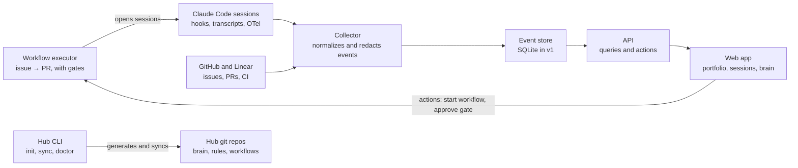

# Initial spec — Hubs and agents platform

2026-09-27 · José Henrique Roquette. This repo file (`docs/SPEC.md`) is the source of truth; the claude.ai document is history.

## Vision and problem

The platform turns what `loki-trader-hub` does by hand for one project into a product that builds, runs and observes AI agent hubs for N projects. It also manages itself and Loki Trader itself.

Today the Loki Trader hub already brings together the right pieces: versioned memory (`brain/`), cross-repo rules (`AGENTS.md`), a multi-repo launcher (`agent`), a workflow plugin with delivery agents, a runner that takes a Linear issue to a PR (`agent_runner.py`), transcript mining, retro and benchmark. The problem is that everything is coupled to one project:

- **It is not reusable.** Repo names, the Linear team, the rules and the paths are hard-coded. A new project starts from scratch.
- **It is not visible.** What the agents do, decide and learn is scattered across JSONL transcripts, logs in `.agent-runs/`, `brain/_inbox/` and PRs. There is no single place to see it together, live or over time.
- **It is not governed.** The workflow (plan → approval → code → CI → PR) is implicit in text rules, hooks and scripts. It cannot be defined, versioned or compared across projects.

## Goals and non-goals

Success for v1 is recreating `loki-trader-hub` through the platform without losing capability, and seeing on one screen what each agent did in a session.

**Goals**

1. **Create generic hubs.** One command builds the hub of any project (1 to N repos) with brain, rules, launcher, plugin and scripts.
2. **Define workflows as data.** Steps, gates, approvers and limits (turns, cost) are versioned in the hub, not scattered across text and scripts.
3. **Observe agents.** Show, live and in history, what each session did: task, repo, tools used, files touched, decisions and cost.
4. **Make knowledge visible.** Show what context the agent receives (rules, brain, memory), what it learned (learnings, inbox) and where each item came from.
5. **Audit the reasoning.** Reconstruct why a decision was made from the transcript: messages, reasoning summaries and tool calls.

**Non-goals (v1)**

- It is not a new agent or an LLM runtime. The platform orchestrates and observes Claude Code (and others later); it does not replace it.
- It is not multi-user or SaaS. v1 is local-first, for one owner.
- It does not edit the brain on its own. It keeps the current hub's rule: agents propose in `_inbox/`, and the human decides.
- It does not promise to read the model's "mind". It shows what the transcript records, nothing more.

## Core concepts

The model has nine entities. All of them already exist implicitly in Loki Trader, and the platform only gives them a name and a schema.

| Concept | What it is | Today's equivalent in Loki Trader |
| --- | --- | --- |
| Project | A product with 1 to N repos and a task tracker | Loki Trader (team `LOK` in Linear) |
| Hub | The project's control repo: rules, brain, workflows, plugin, scripts | `loki-trader-hub` |
| Repo | A code repository managed by the hub, with its own `AGENTS.md` | `tradeSentinel`, `loki-trader-ui` |
| Workflow | A sequence of steps with gates, approvers and limits | The states of `agent_runner.py` and the plugin's `/feature` |
| Agent | A role with instructions, tools and a model | Agents in `plugin/loki-workflow/agents/` |
| Session | One concrete execution of an agent, with transcript, cost and outcome | JSONL transcripts and `.agent-runs/*.jsonl` |
| WorkflowRun | One execution of a workflow; it contains the Sessions it starts ("run" is never a synonym for Session) | One `agent_runner.py` pass from issue to PR |
| Brain | Curated, versioned knowledge, with provenance | `brain/` (index, now, decisions, learnings…) |
| Learning | Something learned in a session, proposed and then accepted or rejected | `brain/_inbox/` → `brain/learnings/` and auto memory |

## Layer 1: hub generator (CLI)

A CLI creates and maintains hubs from a project configuration file. Everything that is Loki-specific today becomes a parameter or an optional module.

```
hub init <project> --repos org/backend,org/frontend --tracker linear:LOK
hub sync        # reapplies templates without overwriting what the project customized
hub doctor      # checks rules, links, dead references and instruction size
```

**What to extract from `loki-trader-hub`**

| Current piece | Becomes on the platform | Generic or module |
| --- | --- | --- |
| `brain/` (index, now, decisions, learnings, playbooks, journal, `_inbox/`, `auto/`) | Brain template with frontmatter and provenance | Generic |
| `AGENTS.md`/`CLAUDE.md` with cross-repo rules | Template with base rules (authorship, worktree, no push to `main`) and project rules | Generic + project rules |
| `agent` (launcher with `--add-dir` and appended AGENTS.md files) | Launcher generated from the repo list | Generic |
| `scripts/worktree.sh` | Isolated per-task worktrees, with their own ports and `.env` | Generic, with per-stack hooks |
| `scripts/brief.py` | Session brief (now, journal, git/PR/CI state) | Generic |
| `scripts/agent_runner.py` | Workflow executor (issue → PR as a state machine) | Generic, reading the workflow as data |
| `mine_transcripts.py`, `recall_transcripts.py`, `retro_metrics.py` | Layer 2 ingestion and analysis | Generic |
| `bench.py` | Agent configuration benchmark on closed issues | Module |
| `agent_config_lint.py`, `features_check.py` | `hub doctor` and feature validation | Generic |
| `plugin/loki-workflow/` (agents, skills, hooks) and marketplace | Platform base plugin + project plugin | Generic + project |
| `contract-sync.sh` (OpenAPI backend → frontend) | Cross-repo contract recipe | Module |
| Red-chain, Decimal, paper/testnet | Loki domain rules | Stays in the project |

Design rule: the generated hub remains just versioned files in a private GitHub repo, accessible only to the owners. That way it works in the terminal, in cloud sessions and without layer 2 running.

## Layer 2: control plane and observability

A web app reads the hubs and the agents' events and answers five questions, one per view.

| View | Question it answers | Content |
| --- | --- | --- |
| Portfolio | How are my projects doing? | Hubs, repos, tasks in progress, open PRs, CI, cost of the week |
| Workflows | How should work flow? | Editor and visualization of steps and gates; which step each task is at; where it gets stuck |
| Live sessions | What are the agents doing right now? | Active sessions by repo and task, last action, accumulated turns and cost, pending approvals |
| Session timeline | Why did the agent do that? | Messages, reasoning summaries, tool calls, files and diffs, marked decisions and the final outcome |
| Knowledge | What does it know and what did it learn? | Context loaded in the session (rules, brain, memory), proposed learnings, inbox triage, evolution over time |

**Decisions as objects.** A decision is a stretch of the session with a choice, discarded alternatives and a rationale. In v1 it is extracted from the transcript. Later, agents can record it explicitly through a skill or hook (`/decide`).

**Learning with provenance.** Every brain item and every learning keeps its source session, its author (human or agent) and its status. The knowledge view shows the path session → proposal → accepted → rule and measures whether the rule reduced the failure that motivated it (which `mine_transcripts.py` and `retro_metrics.py` already start to do).

**Actions, not just reading (after v1).** Start a workflow on an issue, approve a gate, pause or cancel a session, accept a learning.

## Data sources and event model

Almost all of the data already exists. The platform normalizes five sources into a single event stream per session.

| Source | What it brings | Latency |
| --- | --- | --- |
| Claude Code hooks | Session start and end, each tool use, prompts, permission requests | Real time |
| Transcripts (`~/.claude/projects/*.jsonl`) | Full messages, recorded reasoning, tool calls and results | After each turn |
| Claude Code OpenTelemetry | Tokens, cost, duration, errors | Real time |
| Workflow executor logs (today `.agent-runs/`) | Step, gate, outcome, failure reason | Per step |
| GitHub and tracker (Linear) | Issues, PRs, commits, CI, review | Polling or webhook |

**Canonical event** (draft): `{project, repo, session, agent, workflow, step, type, timestamp, payload, source}`. The initial types are `session.start`, `session.end`, `tool.call`, `tool.result`, `message`, `reasoning`, `decision`, `gate.request`, `gate.result`, `learning.proposed` and `learning.accepted`.

**Privacy and redaction.** Transcripts can contain secrets and personal data. Ingestion redacts key and token patterns before writing, and the data stays on the machine in v1.

## Proposed architecture

v1 runs entirely on the owner's machine: a collector, an event store and a web app, plus the CLI that generates the hubs.



The sessions and GitHub/Linear feed the collector, and the web app reads everything through the API. The app's actions go back to the workflow executor. The API also reads the hub repos to show brain, rules and workflows.

- **Stack (decided, ADRs 0001–0004 and 0008):** Python 3.14 in a uv workspace with one package per component (`core`, `storage`, `collector`, `cli`; `api` later) under a lean hexagonal architecture: entities, use cases and ports in `core`, adapters in the other packages. Persistence is SQLAlchemy Core + Alembic on SQLite, moving to Postgres via config when there are multiple users. FastAPI + Pydantic for the API and React on the front end come in Phase 2.
- **Hooks as sensors:** the generated hub installs Claude Code hooks that send events to the local collector. Without the collector running, the hooks fail silently and the session carries on normally.
- **Adapters:** Claude Code is the first. Other agents (Codex, Cursor) come in as adapters that emit the same canonical event.

## MVP and phases

The MVP goes up to Phase 2: generate hubs from Loki and see the agents' sessions on one screen. Each phase starts only when the previous one's gate passes.

| Phase | Content | Gate to the next |
| --- | --- | --- |
| 0 · Foundation (MVP) | New GitHub repo, approved spec, the foundation (stack and standards in [ADRs 0001–0008](adr/), uv workspace, `make check-fast`/`make check` gates, CI), CLI and collector skeleton | The platform's own hub generated by the CLI |
| 1 · Hub generator (MVP) | Extract brain, rules, launcher, worktrees, brief and plugin; `hub init`, `sync` and `doctor` | Loki hub recreated, same `make check` and bench |
| 2 · Read-only observability (MVP) | Hooks and transcripts collector, session timeline, portfolio and live sessions | Sessions of both projects live and in history |
| 3 · Knowledge and decisions | Provenance in the brain, inbox triage in the UI, extracted decisions, learning metrics | One learning traced from the session to the rule |
| 4 · Workflows as data and actions | Generic executor reading the workflow, gates approved from the UI, adapters for other agents | — |

The order follows dogfooding: the first generated hub is the platform's own, and the second replaces `loki-trader-hub`. Editable workflows come later because they depend on observation already showing where the current flow gets stuck.

## Open decisions

The recommendations are a starting point.

| Decision | Options | Recommendation |
| --- | --- | --- |
| Name and where it lives | **Decided:** `agent-hub`, private repo in the personal account `jroquette` | — |
| Agent scope | Only Claude Code, or several from the start | Only Claude Code in v1, with the canonical event ready for adapters |
| Where it runs | Local-first or hosted service | Local-first in v1. Hosted only when there is a second user |
| Stack | **Decided:** see [ADR 0001](adr/0001-uv-workspace-with-namespace-packages.md), [ADR 0002](adr/0002-lean-hexagonal-architecture.md), [ADR 0003](adr/0003-persistence-sqlalchemy-core-and-alembic.md), [ADR 0004](adr/0004-rest-api-standard.md) and [ADR 0008](adr/0008-cli-as-composition-root.md) | — |
| Task tracker | Linear only, or a generic interface (Linear, GitHub Issues, Jira) | Generic interface with Linear as the first implementation |

## Defined directions (2026-09-27)

**1. Workflow: declarative YAML executed by a Python engine.**

- The workflow is a declarative document (YAML or JSON) validated by a Pydantic schema. It holds the steps, the type of each one (`agent`, `script`, `gate`, `human`), inputs, outputs, limits and what to execute.
- A deterministic Python engine reads the document and drives the steps. Orchestration spends no tokens: the LLM only runs inside `agent` steps and only receives that step's instruction, not the whole workflow.
- Deterministic work (tests, lint, contract sync, opening a PR) becomes a `script` step, with no LLM.
- The UI edits the same document. It is stored on the platform with a version and history, and each execution records the workflow version it used.

**2. Brain: stays in the hub repo, which is private and ours only.**

- The hub remains versioned files in git, as in Layer 1. The hub repo is private, only the owners have access, and how it works is not shared.
- Brain, internal rules, workflows, plugin and scripts live only in the hub. The code repos get the minimum: an `AGENTS.md` with basic commands and conventions.
- Our agent receives the brain because it is launched from the hub (launcher with the repos attached, as today). Another agent that opens only the code repos does not receive that knowledge.
- `hub doctor` checks that nothing from the brain was copied into the code repos.
- Cloud sessions need access to the hub repo through the GitHub App, granted only on our account.
- A hosted brain service waits until the platform becomes a product with customers.

**3. Transcripts: temporary raw material, not working memory.**

The hub keeps working with derived data that is small and structured. The raw transcript only serves for auditing and for generating those derivatives.

| Layer | What it keeps | Proposed retention |
| --- | --- | --- |
| Structured events | Tool calls, files touched, steps, gates, cost, outcome | Long (as long as the project exists) |
| Session derivatives | Summary, decisions with rationale, proposed learnings | Long; accepted ones become brain |
| Raw transcript | Full conversation, with secrets redacted before writing | Short, compressed in cold storage; period to be defined |

Continuity between sessions comes from the brain and the summaries, not from rereading transcripts. A job after each session extracts the derivatives. After the period, the raw transcript is deleted.

**Impacts on the rest of the spec**

- No architecture change: v1 remains local-first, with the hub in git. The difference is that the hub repo is private and is the only place where the brain exists.

**Open questions**

- [ ] What is the retention period for the raw transcript?
- [ ] When the platform becomes a product, does the agent run on our infrastructure (protected brain) or in the customer's environment (mitigations only)?
- [ ] Should cloud sessions (claude.ai/code) emit events to the collector, and how?
